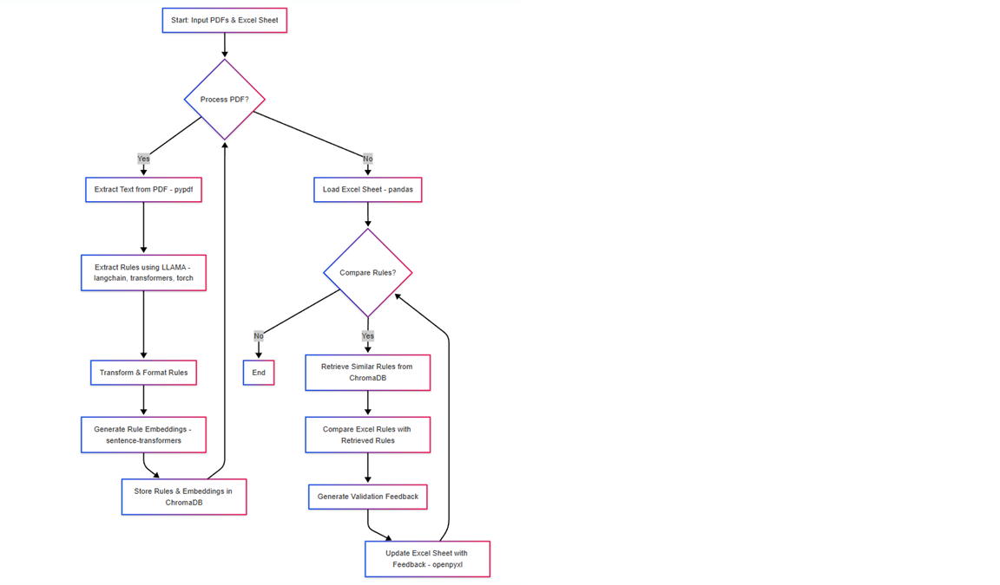
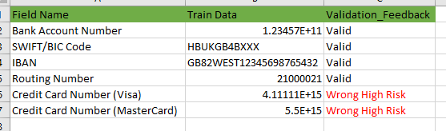

# 🚀 Project Name

## 📌 Table of Contents
- [Introduction](#introduction)
- [Demo](#demo)
- [Inspiration](#inspiration)
- [What It Does](#what-it-does)
- [How We Built It](#how-we-built-it)
- [Challenges We Faced](#challenges-we-faced)
- [How to Run](#how-to-run)
- [Tech Stack](#tech-stack)
- [Team](#team)

---


## 🎯 Introduction
To achieve this, we'll build a Gen-AI-based rule profiling model using Hugging Face's LLAMA LLM, process input PDFs, extract and transform data, store it in a Vector Database, compare the extracted rules with an Excel sheet, and update the Excel sheet with validation feedback.

   - We will build an LLM-based ruling profiling model that:
   - Extracts data from a PDF file.
   - Encrypts or transforms the data using LLAMA (Hugging Face).
   - Stores the transformed data in a Vector Database (ChromaDB).
   - Loads an Excel file and compares it with extracted rules.
   - Validates the rules and updates the Excel file with feedback.
   - Exposes the process as a Flask API using Swagger UI.

## 🎥 Demo
🔗 [Live Demo](#) (if applicable)  
📹 [Video Demo](#) (if applicable)  
🖼️ Screenshots:



*Figure: Flow diagram showcasing the architecture folder integration.*

Explanation of the Flowchart:
1.	Start: The process begins with input PDFs and an Excel sheet containing rules.
2.	Process PDF?: The system checks if there are more PDFs to process.
3.	Extract Text from PDF (pypdf): If there are PDFs, the text is extracted using pypdf.
4.	Extract Rules using LLAMA (langchain, transformers, torch): The extracted text is passed to the Llama 2 model (managed by LangChain, Transformers, and PyTorch) to extract rules.
5.	Transform & Format Rules: The extracted rules are formatted and cleaned.
6.	Generate Rule Embeddings (sentence-transformers): The rules are converted into vector embeddings using sentence-transformers.
7.	Store Rules & Embeddings in ChromaDB: The rules and embeddings are stored in the ChromaDB vector database.
8.	Load Excel Sheet (pandas): If there are no more PDFs to process, the Excel sheet is loaded using pandas.
9.	Compare Rules?: The system checks if rules from the excel sheet need to be compared.
10.	Retrieve Similar Rules from ChromaDB: Similar rules are retrieved from ChromaDB based on the Excel sheet rules.
11.	Compare Excel Rules with Retrieved Rules: The retrieved rules are compared with the rules from the Excel sheet.
12.	Generate Validation Feedback: Validation feedback is generated based on the comparison.
13.	Update Excel Sheet with Feedback (openpyxl): The Excel sheet is updated with the validation feedback using openpyxl.
14.	End: The process ends.

   Train Data  
   Validation Result Data  
   Rules Result Data  

🖼️ Screenshots:



*Figure: Flow diagram showcasing the architecture folder integration.*
## 💡 Inspiration
This Gen-AI-powered ruling profiling model is designed for automated rule validation, compliance checks, and data transformation using LLMs like Llama-2-7B. It is particularly useful in industries that require rule-based decision-making.
## ⚙️ What It Does
1. Automated Rule Extraction from PDFs
Extracts regulatory rules or guidelines from PDF documents (e.g., contracts, policies, legal documents).

Uses OCR or NLP techniques to extract structured text from unstructured PDFs.

💡 Example: Extracting tax compliance rules from government regulatory documents.

2. Understanding & Transforming Data with LLAMA-2
Uses Meta’s Llama-2-7B to understand, encrypt, or transform extracted text.

The LLM ensures the extracted rules are accurate, relevant, and structured.

💡 Example: Transforming legal contract terms into a simplified, machine-readable format.

3. Storing Extracted Data in a Vector Database (VectorDB)
Stores the extracted rules in a Vector Database (ChromaDB, FAISS, or Pinecone).

Enables fast retrieval and comparison of new input rules against stored historical rules.

💡 Example: A bank stores risk assessment rules and compares them against new loan applications for automated compliance checks.

4. Comparing Extracted Data with Existing Rules in an Excel Sheet
Loads an Excel file containing predefined rules or standards.

Uses LLM to compare extracted rules with existing rules and identify matches or discrepancies.

💡 Example: A pharmaceutical company validates FDA compliance rules in a drug approval document by comparing them with internal guidelines.

5. Updating the Excel File with Validation Feedback
Adds an extra column in the Excel sheet with feedback on whether the rule matches, differs, or needs review.

Automates manual review processes, reducing human error and speeding up decision-making.

💡 Example: An audit firm updates an Excel sheet with feedback on whether a company's financial disclosures match tax regulations.

## 🛠️ How We Built It
Llama-2-7b-chat-hf is a 7-billion parameter chat-optimized model by Meta. It's designed for conversational AI, reasoning, and text generation.

If you want to use Llama-2-7b-chat-hf in the project, ensure that:

You have a powerful GPU (24GB VRAM or more) or use a cloud solution like AWS, Google Colab, or Hugging Face Inference API.


 ```sh
     model_name = "meta-llama/Llama-2-7b-chat-hf"
    tokenizer = AutoTokenizer.from_pretrained(model_name)
    model = AutoModelForCausalLM.from_pretrained(model_name, device_map="cuda")
    
    inputs = tokenizer(prompt, return_tensors="pt", truncation=True, max_length=4096).to("cuda")
    outputs = model.generate(**inputs,max_new_tokens=500)
   ```

## 🚧 Challenges We Faced
Describe the major technical or non-technical challenges your team encountered.

## 🏃 How to Run
1. Clone the repository  
   ```sh
   git clone https://github.com/ewfx/gaidp-4-qubits.git
   ```
2. Install dependencies  
   ```sh
    pip install -r requirements.txt (for Python)
   ```
     
3. Run the project  
   ```sh
   python code/src/main.py
   ```
4. Swagger UI at 
   ```sh
    http://127.0.0.1:5000/swagger/
   ```
   Swagger UI 

   Train Data  
   Validation Result Data  
   Rukes Result Data  
## 🚧 Final API Workflow
- 🔹 Upload PDF → Extracts rules from PDF
- 🔹 Stores extracted data in VectorDB
- 🔹 Validates extracted rules against Excel rules
- 🔹 Updates the Excel file with validation feedback
- 🔹 Access Swagger UI at http://127.0.0.1:5000/swagger/

## 🏗️ Tech Stack
- 🔹 transformers & torch → For Hugging Face LLAMA model
- 🔹 langchain → To manage LLM interactions
- 🔹 pypdf → To extract text from PDFs
- 🔹 pandas & openpyxl → To handle Excel files
- 🔹 chromadb → For Vector Database
- 🔹 flask & flask-swagger-ui → To build a REST API

## 👥 Team
- **Your Name** - [GitHub](#) | [LinkedIn](#)
- 🔹 Shibu Kannan 
- 🔹 NandhaKumar
- 🔹 Karthick
- 🔹 Thirusangu
- 🔹 Nayab Rasool Shaik

- **Teammate 2** - [GitHub](#) | [LinkedIn](#)


